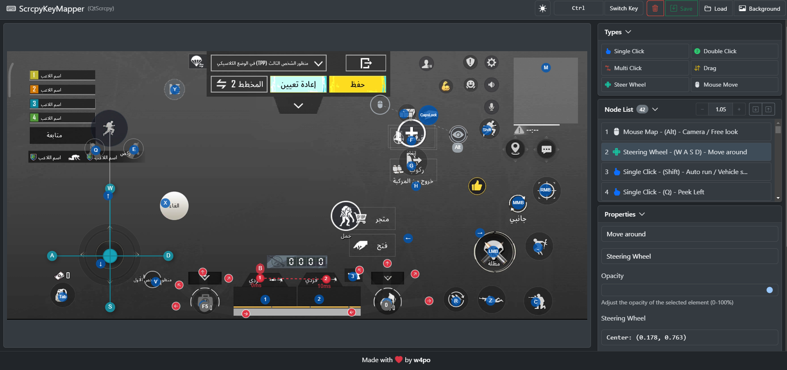

# ScrcpyKeyMapper

A GUI key mapping utility for [QtScrcpy](https://github.com/barry-ran/QtScrcpy), allowing you to create and manage keyboard bindings for mobile applications and games.

## 🚀 Features

- Visual key mapping interface
- Support for all mapping types:
  - Click
  - Double-click
  - Multi-click
  - Drag
  - Mouse move
  - Steer wheel
- 🌓 Dark/Light theme support
- 🖼️ Upload background image to work with
- ✨ Easy node editing and management
- 🖱️ Drag-and-drop interface
- 💾 JSON import/export functionality
- 📐 Auto scaling based on background image

## ⌨️ Keyboard Shortcuts

- **Ctrl** - Hold to clone a node
- **Shift** - Hold to move complex nodes
- **Ctrl + Shift** - Hold both to clone and move simultaneously

## 🚦 Getting Started

1. Upload background image to work with
2. Create nodes by selecting the desired node type (double click or drag and drop)
3. Position nodes on the screen where you want the touch events to occur
4. Configure key bindings and properties for each node
5. Export your mapping configuration for use with [QtScrcpy](https://github.com/barry-ran/QtScrcpy)

## 🛠️ Built With

- [Konva.js](https://konvajs.org/) - HTML5 Canvas JavaScript framework
- [Bootstrap 5](https://getbootstrap.com/) - CSS framework

## 💝 Support the Project

If you find this tool helpful and want to support me, you can:

Your support helps maintain and improve ScrcpyKeyMapper! ❤️

## 👨‍💻 Author

Made with ❤️ by [w4po](https://github.com/w4po/ScrcpyKeyMapper)
